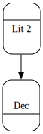
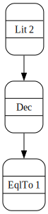
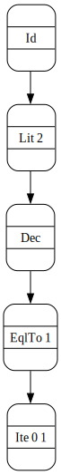

# `cat-herder`

A package for modeling (free) categories with constraints + *n*-ary monoidal
products, intended to support development of embedded domain-specific languages.


## Table of contents
1. [What](#what)
2. [Why](#why)
    - [Back up, why model EDSLs with categories, though?](#back-up)
    - [The big picture](#the-big-picture)
3. [Haddock readability](#haddock-readability)
4. [Examples](#examples)
    - [Overview](#overview)
    - [Hutton's razor — no products](#huttons-razor)
    - [Boolean circuits](#boolean-circuits)
       - [Familiar combinators, mixfix hacks, and the basic morphism type](#notation)
       - [Categorical encoding](#categorical-encoding)
       - [Primitives](#primitives)
       - [Constraints: defining objects of the category](#objects)
       - [A basic evaluator](#a-basic-evaluator)
       - [Examples of terms](#examples-of-terms)
           - [Simple example - implication](#implication)
           - [Complex example — carry-lookahead adder](#carry-lookahead)
5. [Status](#status)
    - [Productive use of the package for DSL development](#productive-use-of-the-package-for-dsl-development)
    - [A granular typeclass hierarchy](#a-granular-typeclass-hierarchy)
6. [Related resources](#related-resources)
    - [Haskell/Idris packages](#haskell-packages)
    - [Reading](#reading)
7. [Usage / forking](#usage)


## What

The main feature of `cat-herder` is a granular typeclass hierarchy for different
category types that supports finite, homogeneously-typed *n*-ary monoidal
products tagged with a type-level `Nat` indicating the size of the product.

The package also offers typeclasses that support freely lifting a set of
primitive morphisms into various types of category in the hierarchy.

This package is principally inspired by
[Conal Elliott's papers](http://conal.net/) and
[blog posts](http://conal.net/blog/posts/circuits-as-a-bicartesian-closed-category),
[Megacz's earlier work on generalized arrows](http://www.megacz.com/berkeley/research),
and the 
[`constrained-categories`](https://hackage.haskell.org/package/constrained-categories)
package. These are also excellent places to look for additional context or
background.


## Intended audience

This README assumes you have more than a beginner's level of understanding
typed functional programming (Haskell in particular), and that 

 - You've had multiple exposures to at least a few ways (e.g. using some
   combination of folds, functors, and monads) of doing things like
     - Defining a language of expressions that models some domain.
     - Parsing or pretty-printing terms of such a language.
     - Evaluating terms of such a language.
 - You understand why problems like these and their solutions productively
   generalize to many other tasks in software development.

The README also assumes some basic prior introduction to the relation between
typed functional programming and category theory. If you are unsure if you meet
this description but have a comfortable working knowledge of what a functor and
a monad are in the context of typed functional programming, Conal Elliott's
papers or Walters (1992) — see the [resources](#related-resources) list — might
be good places to look.


## Why

The motivating use case is facilitating embedded domain-specific language (EDSL)
development. In this context, there are five main concerns or feature-sets that
motivate this package.

 1. **Constraints can be liberating.** Typeclasses with an associated constraint
    (e.g. 
    [§4.2, Sculthorpe et al, 2014](neilsculthorpe.com/publications/constrained-monad-problem.pdf#page=6))
    make it possible to use or easier to use typeclasses with a wider variety of
    concrete datatypes, and this has many consequences for flexibility in domain
    modeling and implementation.
 2. **`Control.Arrow` without `arr`.** Hughes's venerable `Arrow` typeclass
    bundles a lot of functionality in one package, but there are many domains
    where you don't want to be obligated to admit and deal with arbitrary terms
    of type `(->)` in your EDSL.
 3. **Choice of (co)product functor.** Most category/profunctor libraries either
    limit the user to `(,)` ± `Either` or to a variation on cons-lists for
    representing (co)products. If you can live without heterogeneously-typed
    products, then using trees of `(,)`/`Either` of any size to simulate a
    collection can quickly become unwieldy; on the other hand, you may not want
    to be limited to linked-lists to model monoidal products.
 4. **Type-level sizes make more functions total and better model many
    domains.** The classic example of dependent types is a sized collection type
    `f n a` where one of the type parameters is a natural number `n` indicating
    the cardinality of the collection; there are many unsafe functions on garden
    variety collection types whose runtime errors or more complex return types
    (an error `Applicative`) become a compile-time bug in this setting. For
    modeling many domains, finitary `Representable` and `Traversable` container
    types are a natural choice for a product functor, and there many plausibly
    or equally good choices within that class.
 5. **Linear-/affinely-typed domain modeling.** Most category/profunctor
    libraries make a pragmatic trade-off and bundle logically independent
    capabilities into a smaller typeclass hierarchy. However, if you want to
    model any domain where resource accounting is desirable or critical, then
    you *want* a finer-grained ("substructural") hierarchy where copying,
    destruction, and permutations can be more carefully tracked.
    
Those are the 5 main reasons that motivated creating this package instead of
using something else. However, the package is also an experiment.

  - Flexibility, type-safety, and moving domain modeling into types come at a
    price: *sized containers* and *constrained typeclasses* add a lot of
    complexity to satisfying GHC, sometimes limit what can be expressed, or
    increase the amount of work necessary to express something compared to 
    a setting without either of those two features.

  - Similarly, a finer-grained typeclass hierarchy not specialized to `(->)`
    means more typeclasses, more possible typeclass instance derivations (and 
    fewer obvious defaults available), more verbose types, and more difficult 
    type inference.

Some of these costs are borne principally in development of the library and not
necessarily by downstream use: for example, nearly every constrained typeclass
has a default trivial constraint, and between that and e.g. choosing specific
concrete types at sites of use, GHC often has little or no trouble reasoning 
that a hefty and intimidating-looking piles of constraints are satisfied. 

In any case, as an experiment, the primary goal of the package currently is to
flesh out basic functionality for productive EDSL development and assess the
cost/benefit ratio of design decisions on how easy that that basic functionality
is to achieve and then use: this may motivate a significant rewrite, giving up 
constraints, or focusing more effort on unsized containers.


### Back up, why model EDSLs with categories, though? <a name="back-up"></a>

  1. **Program against interfaces, not implementations:** As
  [Gavronovic et al](https://arxiv.org/abs/2402.15332) put it, category theory
  offers "a battle-tested system of interfaces that are learned once, and
  then reliably applied across...fields."
  
  2. **Domain modeling:** Modeling your EDSL in terms of categories can offer
  clearer domain modeling for some contexts: 
  
      - You may have a very precise notion of what your domain is, someone has
        written how to model it categorically, and that's the domain encoding
        you want your DSL to reflect.

      - Your domain may involve terms that are essentially function-like, with
        input and output and with a composition operation, but the only things
        you can do with an actual function `a -> b` (composition, application,
        and wrapping it in a product type together with annotations) are *not
        enough* to adequately model your domain.
      
      - Your domain may involve terms that are essentially function-like but
        `->` can express *too much*: you don't want arbitrary `->` terms in your
        DSL (they may be meaningless or impossible to handle in the general
        case), and hence you need a separate function-like abstraction that
        offers control over this that e.g. `Control.Arrow` and `Data.Profunctor`
        do not. (See the resources by Megacz for more on this.)
      
  3. **Reasoning about code:** More generally, modeling terms of your domain
  as arrows in a category may make it easier to reason equationally about the 
  relationship between the meaning of a program and what the encoding of that 
  program can or must be. Check out the Elliott papers in the **Resources** 
  section for more on this; if you'd prefer to see some of similar ideas without 
  category theory, check out 
  [Elliott (2009)](http://conal.net/papers/type-class-morphisms) instead. 
  Finally, if papers are not your speed and you find recursion schemes
  a friendlier domain to read about, if you read enough blog posts about
  recursion schemes you will encounter related ideas ("program calculation") in
  explanations of why particular recursion schemes have the form they do.
  
  4. **There ain't no variable bookkeeping like no variable bookkeeping:** More
  mechanically speaking, DSLs modeling languages as categories can trade the
  complexity of bookkeeping associated with variables (binding, scope, reasoning
  about shadowing or renaming or fresh identifiers, etc.) for [tacit
  ("point-free") style](https://www.youtube.com/watch?v=seVSlKazsNk). Tacit
  style may not be an obvious fit for some applications, and as a matter of
  taste it tends to be polarizing in a similar way that lisp's syntax is.
  Stack-based programming languages and any domain that can be usefully
  described in terms of "dataflow programming" are candidates for a natural fit,
  modulo the upfront cost of the learning curve.
 
### The big picture

Riffing on #4 above, one way of thinking about the change in perspective is
moving from modeling a program fragment as

 - An expression tree of values.
 - A container of terms — specifically a functor in the "blue-collar functional 
   programmer" sense of `Data.Functor`.
 
to modeling a program fragment as

 - A path in a directed hypergraph where vertices are types (not values) and
   edges are function-like terms — bifunctors contravariant in one argument
   and covariant in the other.
   
     - In a cartesian closed category like `(->)`, currying lets us think of
       programs as paths in a directed graph (no proper hyperedges); when
       currying and `(,)` are opt-in features, then some of the tree-like
       structure of programs comes back into focus.
 
Another way of putting this is that this package most closely models
[multi-sorted ("polychromatic") PROPs](https://ncatlab.org/nlab/show/PROP) or
[concategories](https://www.cl.cam.ac.uk/events/syco/2/slides/levy.pdf), and
hence can be specialized to model multicategories, operads, Lawvere theories, or
polycategories.

Finally, in domains where nested products make sense, another natural way of
thinking about the resulting kind of categories modeled by this package is an
APL-like concatenative ("stack-based") array language where reshaping,
reranking, and broadcasting combinators (e.g. as provided by
[orthotope](https://hackage.haskell.org/package/orthotope)) are a natural medium
for describing many domain computations and a substitute for combinators a
functional programmer without array language exposure might otherwise reach for
— and which may not even be available in a category that isn't cartesian closed.


## Haddock readability

In spite of my best efforts to compensate, none of the available Haddock themes
have CSS that can cope with

  - Large (e.g. explicitly kinded) parameters.
  - Large constraint lists.

  (There are relatively old issues in the `haddock` repository pointing this
  out.) As a result, for some questions it will be easier to browse source files
  rather than the Haddock docs.


## Examples

This is an abbreviated introduction to what using the package looks like. The
root module (`Cat`) and the example modules — `Cat.Unsized.Examples.Arith`,
`Cat.Sized.Examples.Circuit` — offer more thorough introductions.

### Overview
The expected steps for defining an EDSL using this package are:

1. **Pick a categorical encoding:** Figure out what categorical abstraction
   models your domain in a suitable way.
2. **Define your primitives:** Define a datatype encoding the primitive
   morphisms that express features of your domain that aren't captured by the
   plumbing of some combination of categorical typeclasses.
3. **Typeclass instances and associated type families:** Define some typeclass +
   associated type synonyms that define category "parameters", to taste.
   
   - This could include relatively simple things like defining the initial or
     terminal object (if any), indicating a canonical product functor, or
     declaring a distinguished proxy or tag type for `Nat`.
   - It may also be more involved and capture features of your domain like
     restricting the objects of your category via object constraints or
     restricting what kinds of objects can be duplicated or destroyed (or when 
     this can occur).

Terms of your DSL will then be paths in a free category type over your
primitives. At this point you may define pattern synonyms, smart constructors,
and additional typeclass instances related to your domain and limiting the
construction of well-formed terms or providing a more ergonomic interface.

Evaluators, pretty printers, etc. will generally be defined by a fold over the
free structure, or more generally via a functor or natural transformation.

See the resources section for more about this general process.


### Hutton's razor — no products <a name="huttons-razor"></a>

Here we'll look at the simplest example of the workflow outlined above for a
variation on [Hutton's razor](https://www.cs.nott.ac.uk/~pszgmh/semantics.pdf):
a simple language capturing a many-sorted domain with branching control flow — 
i.e. with integer and boolean constants, some arithmetic operations, equality, 
and if-then-else.

  1. We define a set of primitive morphisms (`Razor`).
  2. We define typeclass instances (`HasObject`) that pick out which Haskell
     types are objects of the category and which will be linked via instances
     provided by the package to corresponding associated type families
     (`Object`) for the basic type — `Cat` — that freely lifts a set of
     primitive morphisms into a category.
  3. Terms in the DSL (`RazorTerm`) are values in the relevant free category
     (`Cat`):
     
      ```Haskell
      -- see Cat.Unsized.Category.Free.Data
      data Cat (k :: κ -> κ -> Type) (a :: κ) (b :: κ) where
       Emb :: (Object (Cat k) a, Object (Cat k) b)
           =>     k a b
           -> Cat k a b
       Id  :: Object (Cat k) a
           => Cat k a a
       Of  :: (Object (Cat k) a, Object (Cat k) b, Object (Cat k) c)
           => Cat k b c
           -> Cat k a b
           -> Cat k a c
      ```
     
  4. We define an evaluator by handing the `foldMap` function for the free 
  category type (`Cat`) a function (`evalRazor`) that maps primitive morphisms to 
  morphisms in the category for evaluation (`(->)`); there is also a brief 
  discussion of recursion schemes over categories with 
  [higher-order functors](https://arxiv.org/pdf/2202.13633.pdf#page=33).
     

``` haskell
-- This is an abbreviated version of 'Cat.Unsized.Examples.Arith'.
module Hutton where

import Prelude hiding (foldMap)
import Data.Bool (bool)

import Cat.Unsized.Functor
  ( Fix ( In
        )
  , cata
  )

import Cat.Unsized.Category.Class 
  ( Object
  , Object'
  )
import Cat.Unsized.Category.Free.Data
  ( Cat ( Emb
        , Id
        , Of
        )
  , HasObject (ObjectOf)
  , foldMap
  , CatF ( EmbF
         , IdF
         , OfF
         )
  , Cat'
  , mkAlg
  )
import Cat.Unsized.Category.Instances ()
import Cat.Unsized.Category.Free.Instances ()


data Razor a b where
  Lit   :: (RazorObj b) => b   ->      Razor ()   b
  Inc   ::                             Razor Int  Int
  Dec   ::                             Razor Int  Int
  Add   ::                 Int ->      Razor Int  Int
  EqlTo :: (RazorObj a) => a   ->      Razor a    Bool
  Ite   :: (RazorObj b) => b   -> b -> Razor Bool b

deriving instance (Show (Razor a b))

-- This rather contrived constraint defines the objects of the category 'Razor'.
class (Show x, Eq x) => RazorObj x
instance RazorObj Int
instance RazorObj Bool
instance RazorObj ()

-- The 'HasObject' typeclass and its associated type synonym are used to connect
-- our primitive morphisms 'Razor' to the constraints on the 'Category' instance 
-- for 'Cat Razor'.
instance HasObject Razor where
  type ObjectOf Razor a = RazorObj a


-- | A program in the language is a path in the free category over the set of
-- primitive arrows defined by 'Razor'.
type RazorTerm = Cat Razor


-- Example terms:

-- | ≈ @Prelude.id@
noOp :: (Object RazorTerm a)
  => RazorTerm a a
noOp = Id

-- | ≈ @const (1 :: Int)@
one :: RazorTerm () Int
one = Emb $ Lit 1

-- | ≈ @const (2 :: Int)@
two :: RazorTerm () Int
two = Emb $ Lit 2

-- | ≈ @subtract (1 :: Int)@
sub1 :: RazorTerm Int Int
sub1 = Emb Dec

-- | ≈ @const (2 - (1 :: Int))@
alsoOne :: RazorTerm () Int
alsoOne = sub1 `Of` two

-- | ≈ @(== 1) . (const (2 - (1 :: Int)))@
oneIsOne :: RazorTerm () Bool
oneIsOne = Emb (EqlTo 1) `Of` alsoOne

-- | ≈ @bool (0 :: Int) (1 :: Int)@
boolToInt :: RazorTerm Bool Int
boolToInt = Emb (Ite 0 1)

{- |
@
≈ (bool (0 :: Int) (1 :: Int))
. ((== 1) . (const (2 - (1 :: Int))))
. id
@
-}
alsoOneIsOne :: RazorTerm () Int
alsoOneIsOne = boolToInt `Of` oneIsOne `Of` noOp


-- | This algebra maps primitive morphisms into a target category - @(->)@.
evalRazor :: forall a b. Razor a b -> (a -> b)
evalRazor (Lit     b) = const    b
evalRazor  Inc        = (+       1)
evalRazor  Dec        = subtract 1
evalRazor (Add     a) = (+       a)
evalRazor (EqlTo   a) = (==      a)
evalRazor (Ite   f t) = bool   f t


{- |
>>> :t evalRazorTerm (Emb $ Lit True)
evalRazorTerm (Emb $ Lit True) :: () -> Bool
>>> evalRazorTerm (Emb $ Lit True) $ ()
True
it :: Bool
>>> evalRazorTerm alsoOneIsOne $ ()
1
it :: Int
-}
evalRazorTerm :: forall a b.
  (Object RazorTerm a, Object RazorTerm b)
  => RazorTerm a b -> (a -> b)
evalRazorTerm = foldMap evalRazor
```

Instead of using `Cat` and the `Cat`-specific `foldMap`, we could also use
recursion schemes: `Cat.Unsized.Functor` has a 
[higher-order functor typeclass](https://arxiv.org/pdf/2202.13633.pdf#page=33)
and associated widgets to permit recursion schemes over categories. 

``` haskell
-- Abbreviated snippets from 'Cat.Unsized.Functor', adapted mostly from
-- https://bartoszmilewski.com/2018/02/20/free-monoidal-profunctors

type (p :: κ -> κ -> Type) :~> (q :: κ -> κ -> Type) =
  forall (a :: κ) (b :: κ). (Object p a, Object p b, Object q a, Object q b) 
    => a `p` b -> a `q` b

type (p :: κ -> κ -> Type) ::~> (q :: κ -> κ -> Type) =
  forall a b. a `p` b -> a `q` b

class HFunctor (η :: (κ -> κ -> Type) -> κ -> κ -> Type) where
  hfmap :: forall p q. (forall x. Object p x => Object' q x)
        => (p :~> q) -> η p ::~> η q

newtype Fix (η :: (κ -> κ -> Type) -> κ -> κ -> Type) (a :: κ) (b :: κ) =
  In { out :: η (Fix η) a b }

cata :: forall η q a b.
     ( HFunctor η, Object (Fix η) a, Object (Fix η) b
     , (forall x. Object (Fix η) x => Object' q x))
     => η q ::~> q
     -> Fix η a b -> q a b
cata alg = alg <<< hfmap (cata alg) <<< out
-- ...

-- See 'Cat.Unsized.Functor' / 'Cat.Sized.Functor' and 'Cat._.Category.Free.Data'
-- for more on what this looks like — especially what pattern functors are like.
```

Continuing the `Razor` example:

``` haskell
{- Cat' Razor = Fix (CatF Razor).
   Cat' Razor ≅ Cat Razor
   
... where CatF is the pattern functor for Cat, defined in 
Cat.Unsized.Category.Free.Data -}
type RazorTerm' = Cat' Razor

-- | ≈ @id@
noOp' :: (Object RazorTerm' a)
  => RazorTerm' a a
noOp' = In IdF

-- | ≈ @const (2 :: Int)@
two' :: RazorTerm' () Int
two' = In $ EmbF $ Lit 2

-- | ≈ @subtract (1 :: Int)@
sub1' :: RazorTerm' Int Int
sub1' = In $ EmbF Dec

-- | ≈ @const (2 - (1 :: Int))@
alsoOne' :: RazorTerm' () Int
alsoOne' = In $ sub1' `OfF` two'

-- | ≈ @(== 1) <<< (const (2 - (1 :: Int)))@
oneIsOne' :: RazorTerm' () Bool
oneIsOne' = In $ In (EmbF (EqlTo 1)) `OfF` alsoOne'

-- | ≈ @bool (0 :: Int) (1 :: Int)@
boolToInt' :: RazorTerm' Bool Int
boolToInt' = In $ EmbF (Ite 0 1)

{- |
@
≈ (bool (0 :: Int) (1 :: Int))
<<< ((== 1) <<< (const (2 - (1 :: Int))))
<<< id
@
-}
alsoOneIsOne' :: RazorTerm' () Int
alsoOneIsOne' = In $ boolToInt' `OfF` In (oneIsOne' `OfF` noOp')


{- |

>>> :t evalRazorTerm' $ In $ EmbF $ Lit True
evalRazorTerm' $ In $ EmbF $ Lit True :: () -> Bool
>>> evalRazorTerm' (In $ EmbF $ Lit True) $ ()
True
it :: Bool
>>> evalRazorTerm' alsoOneIsOne' $ ()
1
it :: Int
-}
evalRazorTerm' :: forall a b.
  (RazorObj a, RazorObj b, (forall x. Object RazorTerm' x => Object' (->) x))
  => RazorTerm' a b -> (a -> b)
evalRazorTerm' = cata $ mkAlg evalRazor
```


In addition to support for recursion schemes, there is also (currently limited)
support for annotating free category values with the 
[trees that grow](https://gitlab.haskell.org/ghc/ghc/-/wikis/implementing-trees-that-grow/trees-that-grow-guidance)
approach. While not detailed further here for brevity, we can use that to pretty-print AST terms
to GraphViz. Below are renderings of `alsoOne`, `oneIsOne`, and `alsoOneIsOne`:






### Boolean circuits

This more complex example uses more of the features offered by the package,
including morphisms with `Nat`-tagged monoidal products and cartesian
combinators. It is more detailed than the arithmetic example, but is an
abbreviated presentation of the contents of `Cat.Sized.Examples.Circuit`; see
that module for more exposition and context.

#### Familiar combinators, mixfix hacks, and the basic morphism type <a name="notation"></a>

This is a more complex example, so it's worth clarifying up front what 
familiar-looking combinators mean here — some have been redefined in this 
package or given multiple sets of synonyms to avoid railroading users into a 
particular namespace management strategy.

As a first introduction to the package, the combinator conventions in this 
example are as follows:

 - Homophonous ("homographic") synonyms for Prelude combinators are used in 
   expressions in the object language (EDSL). If you understand those 
   combinators when they're used elsewhere, they behave the way you'd expect 
   here. For example,

      - `(.)` refers to `Cat.Sized.Semigroupoid.Class` composition.
      - `id` refers to the identity morphism from `Cat.Sized.Category.Class`.
      - `(***)` refers to the monoidal tensor product from
        `Cat.Sized.Monoidal.Class`.
      - `(&&&)` refers to the "fork" operation from `Cat.Sized.Diagonal.Class` —
        except in one or two cases where it is explicitly qualified to indicate
        that the `Control.Arrow` combinator is used instead.

 - `Control.Arrow` operators — `(>>>)`, `(<<<)` — are used for composition in
   the metalanguage — `(->)`.

 - `IcelandJack`'s 
 [mixfix operator hack](https://www.reddit.com/r/haskell/comments/xdcx08/comment/iog81nv)
 is used to make large morphisms a bit more readable, especially in source code (less so in 
 Haddock-generated docs):

``` haskell
-- A morphism in the category k from a to b:

>   k a b
> ≡ a `k` b
> ≡ a -| k |-> b


-- A morphism from a vector of 3 Bools to a vector of 2 Bools:

>   Circuit VS.Vector 3 2 Bool Bool
> ≡ Bool -| Circuit VS.Vector 3 2 |-> Bool
 
--  Now the source object of the morphism and its multiplicity are on the left,
--  and information about the target object and its multiplicity are to the 
--  right.
```

Above you see a typical morphism type in this package:

 - Such a morphism *always* maps from a homogeneously-typed product to a
   homogeneously-typed product, and the monoidal product is part of the type of
   the morphism. 
 - In general though, morphisms don't have to be to and from the same 
   types — a type like `Bool` doesn't have to show up on both sides, and we can
   have arbitrarily nested products of products. The `Razor` example has a 
   `Sized` variant (`Cat.Sized.Examples.Arith`) that demonstrates differing 
   source and target carrier objects, and the Boolean circuit example below 
   illustrates nested products.


#### Categorical encoding

The set of Boolean functions can be defined in terms of the freely generated
strict symmetric monoidal/cartesian category over a set of generator morphisms
("logic gates") that are complete with respect to Boolean functions.

 - The objects of the category are (indexed by) the natural numbers: the object
   indexed by a particular *n* is an *n*-ary product of Booleans ("*𝔹ⁿ*").
 - A morphism from *n* to *m* is a function with *n* inputs and *m* outputs.
 - The tensor product is addition: if `f` takes *n₀* inputs to *m₀* outputs and
   `g` takes *n₁* inputs to *m₁* outputs, then `f ⊗ g` takes *n₀ + n₁* inputs to 
   *m₀ + m₁* outputs.


#### Primitives

We specify two size-polymorphic introduction forms — `InT` and `InF` — and a
variety of size-polymorphic elimination primitives for them. (See
`Cat.Sized.Examples.Circuit` for discussion of other directions one might pick
and why, with special attention to trade-offs for reasoning about sized
products and manipulating terms.)

``` haskell
data Circuit (φ :: Nat -> Type -> Type) (n :: Nat) (m :: Nat) (a :: Type) (b :: Type) where
  InT  :: (KnownNat m) => Bool -| Circuit φ 0 m |-> Bool
  InF  :: (KnownNat m) => Bool -| Circuit φ 0 m |-> Bool
  Not  :: (KnownNat n) => Bool -| Circuit φ n n |-> Bool
  Or   :: (KnownNat n) => Bool -| Circuit φ n 1 |-> Bool
  And  :: (KnownNat n) => Bool -| Circuit φ n 1 |-> Bool
  Nor  :: (KnownNat n) => Bool -| Circuit φ n 1 |-> Bool
  Nand :: (KnownNat n) => Bool -| Circuit φ n 1 |-> Bool
  Xor  :: (KnownNat n) => Bool -| Circuit φ n 1 |-> Bool
  Iff  :: (KnownNat n) => Bool -| Circuit φ n 1 |-> Bool
```


#### Constraints: defining objects of the category <a name="objects"></a>

``` haskell
-- For illustration, we define somewhat contrived constraints, especially 
-- considering the GADT above, where introducing terms with objects besides 
-- 'Bool' is impossible.
class ToBool a where
  toBool :: a -> Bool

instance ToBool Bool where
  toBool = P.id

type family CircuitCarrier (φ :: Nat -> κ -> κ) (a :: κ) :: κ where
  CircuitCarrier φ (φ n a) = CircuitCarrier φ a
  CircuitCarrier φ      a  =                  a


{- | This defines the objects of the category whose arrows will be terms of the
EDSL representing Boolean functions. -}
instance HasObject φ Circuit where
  type ObjectOf φ Circuit n a = (KnownNat n, ToBool (CircuitCarrier φ a))


{- | The terms of our EDSL for Boolean functions will be paths in the freely
generated (/n/-ary product) cartesian category over the 'Circuit' primitives. -}
type FreeCircuit = Cart Circuit  -- See 'Cat.Sized.Cartesian.Free.Data' for 'Cart'.
```


#### A basic evaluator

``` haskell

{-
The 'Sized' newtype — see 'Cat.Sized.Semigroupoid' — lets us lift a type `k a b`
with an "unsized" semigroupoid or category instance — like `(->)` — into a 
"sized" one.
-}

{- | A function mapping primitive 'Circuit' morphisms into the cartesian category
@Sized (->)@ with a product functor given by the @vector-sized@ package's 
'Vector' type from "Data.Vector.Sized" (qualified here as 'VS'). -}
evalCircuitPrim :: forall (n :: Nat) (m :: Nat) a b.
     a -| Circuit      VS.Vector n m |-> b
  -> a -| (Sized (->)) VS.Vector n m |-> b
evalCircuitPrim InT  = Sized $ const $ pure True
evalCircuitPrim InF  = Sized $ const $ pure False
evalCircuitPrim Not  = Sized            P.fmap P.not    -- P is the qualified import of Prelude
evalCircuitPrim Or   = Sized $ pure <<< P.or
evalCircuitPrim And  = Sized $ pure <<< P.and
evalCircuitPrim Nor  = Sized $ pure <<< P.not <<< P.or
evalCircuitPrim Nand = Sized $ pure <<< P.not <<< P.and
evalCircuitPrim Iff  = Sized $ pure <<< (uncurry (P.||)     -- CA is 'Control.Arrow'
                                         <<< ((P.not <<< P.or) CA.&&& P.and)) 
evalCircuitPrim Xor  = 
  let xorF = fromMaybe False
         <<< foldr δ (Just False)
      δ False q@(Just False) = q
      δ True    (Just False) = Just True
      δ False q@(Just True ) = q
      δ True    (Just True ) = Nothing
      δ _     q@Nothing      = q
  in  Sized $ pure <<< xorF


{- | Folds a 'FreeCircuit' term to a term in another 
(sized, n-ary, homogeneously-typed) cartesian category with the same product
— @Sized (->) VS.Vector@.

>>> (unSized (eval impliesBin)) $ (fromJust $ VS.fromList @2 [True, True])
Vector [True]

See 'foldMap' in "Cat.Sized.Cartesian.Free.Data".
-}
eval :: forall n m a b.
  ( Object VS.Vector FreeCircuit n a
  , Object VS.Vector FreeCircuit m b
  )
  => a -| FreeCircuit  VS.Vector n m |-> b
  -> a -| (Sized (->)) VS.Vector n m |-> b
eval = foldMap P.id evalCircuitPrim


{- | 

>>> (eval' impliesBin) $ (fromJust $ VS.fromList @2 [True, True])
Vector [True]
>>> (eval' impliesBin) $ (fromJust $ VS.fromList @2 [True, False])
Vector [False]
>>> (eval' impliesBin) $ (fromJust $ VS.fromList @2 [False, True])
Vector [True]
>>> (eval' impliesBin) $ (fromJust $ VS.fromList @2 [False, False])
Vector [True]
-}
eval' :: forall n m a b.
  ( Object VS.Vector FreeCircuit n a
  , Object VS.Vector FreeCircuit m b
  )
  => a -| FreeCircuit VS.Vector n m |-> b
  -> (VS.Vector n a -> VS.Vector m b)
eval' = unSized <<< foldMap P.id evalCircuitPrim
```


#### Examples of terms

##### Simple example - implication <a name="implication"></a>

Implication ("is a subset of") is not included in our set of primitive morphisms
— below we define variations on it in terms of other primitives and available
combinators.

``` haskell
{- | A simple example term of the EDSL: ≈ "λp.λq. ¬p ∨ q". -}
impliesBin :: forall φ. Bool -| FreeCircuit φ 2 1 |-> Bool
impliesBin = Emb Or . (Emb (Not @1) *** Id)


{- | Elementwise 'impliesBin' of two /n/-products /p, q/ (the first and second
input /n/-product, respectively), indicating whether \( p_i \implies q_{i} \). -}
impliesElem :: forall φ n. φ n Bool -| FreeCircuit φ 2 n |-> Bool
impliesElem = join . zipWith impliesBin

-- join    :: φ m a -| k φ n (n * m) |-> a 
-- zipWith :: (a -| k φ n m |-> b) -> (φ l a -| k φ n l |-> φ m b) 


{- | Given two /n/-products ("bit vectors") /p, q/ interpretable as subsets of
some /n/-length universe, 'implies' indicates whether membership in /p/ always
entails membership in /q/. -}
implies :: forall φ n. φ n Bool -| FreeCircuit φ 2 1 |-> Bool
implies = Emb And . impliesElem

```

Note the use of `zipWith` (`Cat.Sized.Functor.Monoidal`) in `impliesElem` above:
this combinator has a slightly different type signature than you may expect. It
has been modified to fit the setting of this package, where the ambient category
is not closed and the monoidal product is not `(,)`. As detailed in that module,
this means that `Applicative` combinators are not available, but very useful
combinators like `zipWith` (generalized in some ways, specialized in others) can
still be defined.

Similarly, `join` is essentially a variant of the familiar monadic `join`
specialized to the setting of interest ('sized, homogeneously-typed product'): 
it flattens one layer of nesting.

Throughout the examples below there will be other examples of combinators
for monoidal categories in the setting of interest, often with names identical
to familiar ones that serve the same or at least an analogous function to their
`base` homophone/homograph (if they have one): `last`, `tail`, `zip`, `sing`, 
`unsing`, and `bising`. Type signatures are given in each case.


##### Complex example — carry-lookahead adder  <a name="carry-lookahead"></a>

This example is less trivial than implication, features compositional structure,
and motivates using more of the available cartesian combinators, and
demonstrates some friction where familiar combinators (folds/scans) are not part
of the categorical toolkit of the available DSL.
    
See e.g. [Adder (electronics)](https://w.wiki/9SJT) for extended background. The
;tldr for readers unfamiliar with Boolean circuits:

  - The naive way of adding two *n*-bit numbers — a ripple-carry adder — is
    sequential, starting from the two least significant ("rightmost" in familiar
    place-value notation) bits of the input numbers and propagating a carry bit
    at each step.
  - We can do better: a carry-lookahead adder lets more computation proceed in
    parallel compared to the naive adder, and accomplishes this with *composable
    building blocks*:
      - *Before* we get a carry-in bit, we can calculate whether a pair of bits
        from the pair of numbers to add (each at position *i*) will propagate an
        incoming carry value or generate one of its own. This summary can be 
        combined with a carry-in bit (whenever it becomes available) to calculate
        a carry-out bit.
      - Even without a carry-in bit, a bit of algebra lets us combine the carry-
        propagate and carry-generate calculations for *blocks* of bits to 
        generate *block*-level propagate and generate bits.
      - We can repeat this process for *sequences* of blocks of bits: to wit, we 
        can build components for pairs of bits, for blocks of 4 bits in terms of
        those, and for 16 bits (4 blocks of 4 bits each) in terms of those.


``` haskell
{- | Map a pair of bits to their carry-generate and carry-propagate bits for
a carry-lookahead adder. -}
fullAdderGP :: forall φ. Bool -| FreeCircuit φ 2 2 |-> Bool
fullAdderGP = Emb And &&& Emb Xor
            

{- | Map a /(generate, propagate, carry-in)/ triple to a /(carry-out, sum)/ pair
for a carry-lookahead adder, where, if ⊕ = @xor@, + = @||@, ⋅ = @&&@, then

 - /carry-out = generate + (propagate ⋅ carry-in)/
 - /sum = propagate ⊕ carry-in/
-}
lookahead :: forall φ. Bool -| FreeCircuit φ 3 2 |-> Bool
lookahead = ( Emb Or
            . (id *** Emb (And @2))
            )
        &&& (del 1 *** Emb Xor)     -- Note the explicit use of a combinator for destroying information

-- 'del' ('Cat.Sized.Semicartesian.Class') takes an index to delete from an /n/-product and
-- yields a morphism that deletes that particular index from an /n/-product.
-- del :: Finite n -> a -| k φ n (n - 1) |-> a


 {- | Map a pair of /n/-bit (unsigned) numbers to /n/ pairs of
/(generate, propagate)/ bits for a carry-lookahead adder.

>>> one2 = numToBools @2 @Int 1     -- See 'Cat.Sized.Examples.Circuit' for the definition.
>>> two2 = numToBools @2 @Int 2
>>> mapM print [one2, two2]
Vector [False,True]
Vector [True,False]
>>> twoTwo2 = fromJust $ VS.fromList @2 [two2, two2]
twoTwo2 :: VS.Vector 2 (VS.Vector 2 Bool)
>>> twoOne2 = fromJust $ VS.fromList @2 [two2, one2]
twoOne2 :: VS.Vector 2 (VS.Vector 2 Bool)
>>> eval' lookaheadCarryGPs $ twoTwo2
Vector [Vector [True,False],Vector [False,False]]  -- generate+propagate for the left and right bits, respectively
>>> eval' lookaheadCarryGPs $ twoOne2
Vector [Vector [False,True],Vector [False,True]]  -- generate+propagate for the left and right bits, respectively
-}
lookaheadCarryGPs :: forall φ n. φ n Bool -| FreeCircuit φ 2 n |-> φ 2 Bool
lookaheadCarryGPs = zipWith fullAdderGP

-- zipWith :: (a -| k φ n m |-> b) -> (φ l a -| k φ n l |-> φ m b) 


{- | Map /4/ pairs of /(generate, propagate)/ bits from a pair of /4/-bit numbers
to a pair of /(group generate, group propagate)/ bits for a carry-lookahead
unit.

That is, given

> [[g₃ p₃], [g₂ p₂], [g₁ p₁], [g₀ p₀]]

the group-generate and group-propagate are defined as:

> gg ≝ g₃ + g₂⋅p₃ + g₁⋅p₂⋅p₃ + g₀⋅p₁⋅p₂⋅p₃

> gp ≝ p₃⋅p₂⋅p₁⋅p₀

where '+' is '||' and '⋅' is '&&'.
-}
lookaheadCarryGGP4 :: forall φ. φ 2 Bool -| FreeCircuit φ 4 2 |-> Bool
lookaheadCarryGGP4 =
  let

    -- | Reverse a 4-product.
    rev4 :: Bool -| FreeCircuit φ 4 4 |-> Bool
    rev4 = swap 1 2 . swap 0 3

    -- 'swap' is a cartesian combinator for permuting a pair of indices, 
    -- defined in 'Cat.Sized.Braided':
    -- swap :: Finite n -> Finite n -> a -| k φ n n |-> a


    -- | Given 4 propagates
    --
    --   > [p₀, p₁, p₂, p₃]
    --
    -- psufs returns
    --
    --   > [True, p₃, (p₂ ⋅ p₃), (p₁ ⋅ p₂ ⋅ p₃)]
    --
    -- This is essentially performing a scan.
    psufs :: Bool -| FreeCircuit φ 4 4 |-> Bool
    psufs = (Emb $ InT @1)
        *** ((    ((    suffix @Type @φ @FreeCircuit @1 @2
                    &&& (Emb $ And @2)
                  )
                  . suffix @Type @φ @FreeCircuit @2 @3
                  )
              &&& (Emb $ And @3)
            )
            . suffix @Type @φ @FreeCircuit @3 @4)  
    
    -- Note that 'suffix' is a cartesian combinator for projections 
    -- defined in "Cat.Sized.Semicartesian":
    -- suffix :: a -| k φ n l |-> a


    -- | Given carry-generates and carry-propagates
    --
    -- > [[g₃, g₂, g₁, g₀], [p₃, p₂, p₁, p₀]]
    --
    -- this returns the group-generate @gg@
    --
    -- > gg ≝ g₃ + g₂⋅p₃ + g₁⋅p₂⋅p₃ + g₀⋅p₁⋅p₂⋅p₃
    gg :: φ 4 Bool -| FreeCircuit φ 2 1 |-> Bool
    gg = (Emb $ Or @4)  -- The first three lines are essentially a dot-product (≡ special case of a fold ≡ jam)
       . join
       . zipWith (Emb $ And @2)
       . (id *** (sing . psufs . rev4 . unsing))  -- ...and 'psufs' is essentially a scan

    -- join    :: φ m a -| k φ n (n * m) |-> a 
    -- zipWith :: (a -| k φ n m |-> b) -> (φ l a -| k φ n l |-> φ m b) 

    -- 'sing' and its inverse 'unsing' introduce or eliminate a single trivial, 
    -- net-size-preserving layer of nesting:
    -- sing   ::     a -| k φ n 1 |-> φ n a
    -- unsing :: φ n a -| k φ 1 n |->     a


    -- | Given carry-generates and carry-propagates
    --
    -- > [[g₃, g₂, g₁, g₀], [p₃, p₂, p₁, p₀]]
    --
    -- this returns the group-propagate @gp@
    --
    -- > gp ≝ p₃⋅p₂⋅p₁⋅p₀
    gp :: φ 4 Bool -| Cart Circuit φ 2 1 |-> Bool
    gp = Emb And  -- Take the && of all the propagates to get the group-propagate bit.
       . join     -- Remove nesting on the propagates
       . last     -- Ignore the generate bits
       
    -- join :: φ m a -| k φ n (n * m) |-> a 

    -- 'last' is a (safe) analogue of the Prelude's 'last': it selects the last 
    -- element of a product:
    -- last :: a -| k φ n 1 |-> a


  in (   gg
     &&& gp
     )
   . zip  -- Rezip the (g,p) pairs into all of the generate bits and all the propagate bits.

   -- zip :: φ m a -| k φ n m |-> φ n a


{- | A composable 4-bit carry-lookahead adder unit that maps

 - A pair of ungrouped (concatenated) 4-bit numbers (most significant bit
   leftmost) plus a trailing carry-in bit: @b₃ b₂ b₁ b₀ a₃ a₂ a₁ a₀ ci@.

to

 - A leading carry-out bit followed by the 4-bit sum (most significant bit
   leftmost): @co s₃ s₂ s₁ s₀@.

Note that this makes use of group-level generate-propagate pairs. -}
lookaheadCarry4Unit :: forall φ. Bool -| FreeCircuit φ 9 5 |-> Bool
lookaheadCarry4Unit =
  let id1 = id @Type @φ @FreeCircuit @1
      id2 = id @Type @φ @FreeCircuit @2
      id3 = id @Type @φ @FreeCircuit @3
      id0 = id @Type @φ @FreeCircuit @0

      -- | Regroup the 8 input bits to 2 blocks of 4, zip them together,
      -- compute 4 generate-propagate pairs, and flatten the result.
      gps :: Bool -| FreeCircuit φ 9 9 |-> Bool
      gps = ( join
            . lookaheadCarryGPs
            . split
            )
        *** id1  -- Leave the carry-in bit alone

      -- 'split' is the inverse of 'join':
      -- split ::     a -| k φ (n * m) n      |-> φ m a
      -- join  :: φ m a -| k φ  n     (n * m) |->     a 


      -- | Map the group-generate, group-propagate, and carry-in bit to a
      -- carry-out bit.
      co' :: Bool -| FreeCircuit φ 3 1 |-> Bool
      co' = (Emb $ Or @2)
          . (id1 *** (Emb $ And @2))

      -- | Generate group-generate+propagate bits from 4 generate-propagate 
      -- pairs, then combine this with the carry-in bit to calculate the 
      -- carry-out bit.
      co  :: Bool -| FreeCircuit φ 9 1 |-> Bool
      co  = co'
          . (  (lookaheadCarryGGP4 . split)
            *** id1
            )

      -- split :: a -| k φ (n * m) n |-> φ m a
            

      -- | Compute 4 sum bits from generate-propagate pairs and the carry-in bit.
      sums :: Bool -| FreeCircuit φ 9 4 |-> Bool
      sums = del 0                       -- Throw-away the carry-out bit;
           . (       lookahead *** id3)  -- a carry-lookahead adder offers a 
           . (id *** lookahead *** id2)  -- faster way of computing this.
           . (id *** lookahead *** id1)
           . (id *** lookahead *** id0)

      -- del :: Finite n -> a -| k φ n (n - 1) |-> a


  in
    (      co
       &&& sums
    )
    . gps


{- | Carry-lookahead adder for a pair of 4-bit numbers with overflow (no carry-out
bit).

>>> tableLc4O = table2I lookaheadCarry4UnitO  -- See 'Cat.Sized.Examples.Circuit' for definition.
tableLc4O :: [((Int, Int), Int)]
>>> testLc4 ((x,y),xy) = ((x + y) `mod` (2 ^ 4)) == xy
testLc4 :: (Eq a, Num a) => ((a, a), a) -> Bool
>>> all testLc4 tableLc4O
True
>>> mapM print $ L.take 20 $ tableLc4O
((0,0),0)
((0,1),1)
((0,2),2)
((0,3),3)
((0,4),4)
((0,5),5)
((0,6),6)
((0,7),7)
((0,8),8)
((0,9),9)
((0,10),10)
((0,11),11)
((0,12),12)
((0,13),13)
((0,14),14)
((0,15),15)
((1,0),1)
((1,1),2)
((1,2),3)
((1,3),4)
-}
lookaheadCarry4UnitO :: forall φ. φ 4 Bool -| FreeCircuit φ 2 4 |-> Bool
lookaheadCarry4UnitO = tail
                     . lookaheadCarry4Unit
                     . (id *** Emb InF)
                     . join
                     
-- tail ::     a -| k φ n  1      |-> a
-- join :: φ m a -| k φ n (n * m) |-> a 


{- | 16-bit adder composed of 'lookaheadCarry4Unit's.

Maps

 - two 16-bit numbers grouped into alternating pairs of 4-bit blocks (most
   significant-bit leftmost) followed by a trailing carry-in bit:
   @b₃₁ b₃₀ b₂₉ b₂₈ a₃₁ a₃₀ a₂₉ a₂₈ b₂₇ b₂₆ b₂₅ b₂₄ a₂₇ ... a₀ ci@

to

 - a leading carry-out bit and their 16-bit sum: @co s₁₅ s₁₄ ...s₀@.
-}
lookaheadCarry16Unit :: forall φ. Bool -| FreeCircuit φ 33 17 |-> Bool
lookaheadCarry16Unit = let id4  = id @Type @φ @FreeCircuit @4
                           id8  = id @Type @φ @FreeCircuit @8
                           id12 = id @Type @φ @FreeCircuit @12
                    in (       lookaheadCarry4Unit *** id12)
                     . (id *** lookaheadCarry4Unit *** id8 )
                     . (id *** lookaheadCarry4Unit *** id4 )
                     . (id *** lookaheadCarry4Unit         )


{- | Sum a pair of 16-bit numbers (most significant bit leftmost) with wraparound
(overflow) using 'lookaheadCarry4Unit' as the building block. -}
lookaheadCarry16UnitO :: forall φ. φ 16 Bool -| FreeCircuit φ 2 16 |-> Bool
lookaheadCarry16UnitO = let

  map4 :: forall n m a b.
       (ToBool (CircuitCarrier φ a), ToBool (CircuitCarrier φ b))
       =>     a -| FreeCircuit φ n m |->     b
       -> φ n a -| FreeCircuit φ 4 4 |-> φ m b
  map4 f = let f' = bising f
           in  f' *** f' *** f' *** f'
           
  -- See 'Cat.Sized.Monoidal.Class'.
  -- bising :: (a -| k φ n m |-> b) -> (φ n a -| k φ 1 1 |-> φ m b)
           

  -- | Each 4-bit carrylookahead adder unit expects 4 bits from one number, 4
  -- bits from the next, and a trailing carry-in bit.
  --
  -- This re-groups the bits of the two incoming 16-bit numbers into adjacent
  -- pairs of 4-bit blocks where the first 4 bit block in each pair comes from
  -- the first 16-bit number, and the second block comes from the other.
  blockify :: φ 16 Bool -| FreeCircuit φ 2 32 |-> Bool
  blockify = join                                 -- Flatten the pair of 8 bit blocks
           . map4 (join . zip)                    -- Zip each group of 4 pairs of bits into a pair of 4 bit blocks from the same number, then flatten each group of pairs of 4 bit blocks into an 8 bit block
           . split @Type @φ @FreeCircuit @4       -- Group the 16 pairs of bits into 4 groups of 4 pairs of bits
           . zip                                  -- Group the ith bit of the first number with that of the second
  in  tail
    . lookaheadCarry16Unit
    . (id *** Emb InF)
    . blockify

-- tail  ::     a -| k φ  n      1      |->     a
-- join  :: φ m a -| k φ  n     (n * m) |->     a
-- split ::     a -| k φ (n * m) n      |-> φ m a
-- zip   :: φ m a -| k φ  n      m      |-> φ n a
```


## Status

__Examining the basic value proposition__. This package is a work-in-progress at
an early stage. The API is not stable and the main goal is prototyping something
*sufficient* for key features of DSL development while supporting *constrained
typeclasses* and *type-indexed monoidal products*. (There are also small 
inconsistencies, TODOs, and features that are only mostly implemented because of
the cost/benefit ratio of finishing or polishing.) These two features in 
particular add a lot of complexity to typechecking and finding appropriate 
generalizations for familiar Haskell typeclasses.

Current supporting goals are similarly exploratory:

 - Stabilizing an API that can capture categories with both products and
   coproducts. 
   
     - The current API for this has barely been sketched, is based on
     profunctors, and looks like it might require replicating some of the
     current hierarchy for categories.
     
     - A more radical experiment that might pay off with a simpler typeclass
     hierarchy: make profunctors the building block of the package rather than
     categories, with categories as a special case. (See also 
     [`proarrow`](https://github.com/sjoerdvisscher/proarrow).)
         
 - Filling out enough of the API for practical evaluation — a few
   interpretation/transformation targets for free categories in an example
   domain or two:
   
     - Evaluation in `->`.
     - Some form of pretty printing (preferably graphviz).
     - Evaluation via tensors 
       ([`orthotope`](https://hackage.haskell.org/package/orthotope) or
       [`numhask-array`](https://hackage.haskell.org/package/numhask-array)
       *n*-dimensional arrays) over a semiring.
         
 - Testing and refining the API by creating DSLs that can productively
   interface with other Haskell libraries and tools for logic programming —
   namely [ersatz](https://hackage.haskell.org/package/ersatz) and
   [souffle-haskell](https://hackage.haskell.org/package/souffle-haskell).
    - See: 
       - Lafont 2003, [*Towards an algebraic theory of Boolean circuits*](https://core.ac.uk/download/pdf/82687279.pdf).
       - Gu 2022, [*Categorical Modelling of Logic Programming: Coalgebra, Functorial Semantics, String Diagrams*](https://discovery.ucl.ac.uk/id/eprint/10168183/1/tao-thesis.pdf).
       - Ghica et al 2024, [*A Fully Compositional Theory of Sequential Digital Circuits: Denotational, Operational, and Algebraic Semantics*](https://arxiv.org/abs/2201.10456).
    - Ideally the interface to logic programming tools should be useful for
      further DSL development.


Below are two major featuresets or milestones; each begins with a summary of
where things are now.


### Productive use of the package for DSL development

__Current status:__ 

 - There are currently free types for many of the category
   classes and each has an associated structure-preserving `foldMap` (mostly
   unable to change the product functor right now) into an instance of the
   associated category class. 
 - Basic recursion schemes (`cata`, `ana`) suitable for use with categories (via
   an `HFunctor` class, etc.) are defined for free category types.
 - There are typeclasses and instances for lifting existing and familiar
   typeclass instances into the package — mostly just for the category `->`.
 - To support evaluation and testing/development, there are two main product
   functors (from `sized-vectors` and `orthotope`) available for use with `->`
   that have instances for most of the `cat-herder` hierarchy.


 1. __GraphViz__. Functionality for generating graphviz diagrams of free paths
    (DSL terms).
 2. __Simpler API__. Simplify typeclass constraints; move concrete instances
    with dependencies outside of base into separate modules (and eventually
    separate packages); eliminate kind polymorphism from most typeclasses;
    consider `numhask-array` for tensors over a semiring instead of/in addition
    to `orthotope`.
 3. __Haddock readability__. A tweaked Haddock CSS file that makes large
    constraints much easier to read.
 4. __Trees that Grow__. Free category types should have (or have variants with)
    phase-indexed annotation slots
    (["trees that grow"](https://gitlab.haskell.org/ghc/ghc/-/wikis/implementing-trees-that-grow/trees-that-grow-guidance)).
 5. __Type-aligned lists__. Add instances for a cons-list-like structure for
    free paths and then generalize the `Semigroupoid`/`Category`/`Monoidal`
    interface to that of type-aligned sequences, as described in
    [the type-aligned package](https://hackage.haskell.org/package/type-aligned)
    and [*Reflection without Remorse*](https://okmij.org/ftp/Haskell/zseq.pdf), 
    with an optional [Cayley representation](https://arxiv.org/pdf/1406.4823.pdf)
    for better performance. (In this context, the current composition-based
    implementation corresponds to "type-aligned lists modeled as binary trees".)
    I suspect this may interact poorly with one or both of constraints and
    type-level size annotations.
 6. __Unsized hierarchy__. Fill out the "unsized" hierarchy: sometimes
    type-level cardinalities etc. present unacceptable trade-offs. This makes
    more sense to focus on /after/ it's clear what API is sufficient for 'sized'
    product functors.
 
 
### A granular typeclass hierarchy

__Current status:__ The current hierarchy covers substructural refinements of
cartesian and cocartesian categories; there is a limited "unsized" (non
`Nat`-indexed) hierarchy mostly serving as a "bridge" from `->`/for `base` 
typeclass instances.

As far as categories with one object go: currently, matrices over a semiring
enter the typeclass hierarchy via an extra semigroupoid typeclass that is
parameterized by a distinguished particular type — the only object in the
category. There may be a better abstraction that avoids duplication of
typeclasses with reasonable ergonomics.

 1. Support for [modeling incremental computation via a generalized notion of a
    derivative](https://arxiv.org/abs/2002.05256).
 2. Support for traced categories.
 3. Support for closed categories, including:
    - An example module with an implementation of *some*thing comparable to a
      variation on lambda calculus (modulo the restrictions of this package's
      focus on finitary, homogeneously-typed products) - stack machine based on
      BCKW calculus?
 4. Better support for categories with one object / maybe internal categories 
    more generally, mostly for the purpose of figuring out how to appropriately
    integrate many familiar and useful typeclasses capturing algebraic
    structures.
 5. Monad and comonad transformers.
 6. Categorical representations (typeclasses ± free types) of basic discrete
    math structures expected to be useful for DSL development, at least as
    examples.
      - Ex: representations of partial functions, finite powersets, order 
      theoretic structures, or regular languages/functions on strings or 
      forests.
 7. Round out the "unsized" hierarchy after it's clearer what API is sufficient
    for type-level size-indexed types. 
 


## Related resources 


### Haskell packages 

An incomplete list:

- [`constrained-categories`](https://hackage.haskell.org/package/constrained-categories)
- [`linear-smc`](https://github.com/jyp/linear-smc)
- [`essence-of-ad`](https://github.com/msakai/essence-of-ad)
- [`concat`](https://github.com/compiling-to-categories/concat)
- [`categorifier`](https://github.com/con-kitty/categorifier)
- [`data-category`](https://hackage.haskell.org/package/data-category)
- [`finite-categories`](https://hackage.haskell.org/package/FiniteCategories)
- [`free-category`](https://hackage.haskell.org/package/free-category)
- [`free-categories`](https://hackage.haskell.org/package/free-categories)
- [`type-aligned`](https://hackage.haskell.org/package/type-aligned)
- [`cascade`](https://hackage.haskell.org/package/Cascade)
- [`XOperad`](https://github.com/BartoszMilewski/XOperad)
- [`multicategories`](https://github.com/ekmett/multicategories)
- [`haskerwaul`](https://github.com/sellout/haskerwaul)
- [`monoidal`](https://github.com/masaeedu/monoidal)
- [`filterable`](https://github.com/masaeedu/filterable)
- [`proarrow`](https://github.com/sjoerdvisscher/proarrow)
- [`idris-ct`](https://github.com/statebox/idris-ct)


### Reading

The resources below center around one or both of: 

 1. The use of category theory to represent, reason about, and manipulate
    programs generally in the context of typed FP or with special emphasis on
    contexts that reflect the setting of this package's focus (finite,
    homogeneous products, etc.): finitary traversable/representable functors, 
    tensor programming, concatenative/array languages, and finite-state models 
    of computation.
 2. Relatively accessible resources about category theory related to
    multicategories, operads, or PROPs, especially ones relevant to the
    computational settings described above.

- Elliott 2017, [*Compiling to Categories*](http://conal.net/papers/compiling-to-categories/compiling-to-categories.pdf).
- Bernardy & Spiwack 2021, [*Evaluating Linear Functions to Symmetric Monoidal Categories*](https://arxiv.org/abs/2103.06195).
- Elliott 2018, [*The simple essence of automatic differentiation*](https://arxiv.org/abs/1804.00746).
- Huot & Shaikhha 2023, [*Denotationally Correct, Purely Functional, Efficient Reverse-mode Automatic Differentiation*](https://arxiv.org/abs/2212.09801).
- Macedo & Oliveira 2013, [*Typing linear algebra: A biproduct-oriented approach*](https://arxiv.org/abs/1312.4818).
- Bonchi et al 2015, [*Full Abstraction for Signal Flow Graphs*](https://www.ioc.ee/~pawel/papers/popl15.pdf).
- Elliott 2018 draft, [*Calculating compilers categorically*](http://conal.net/papers/calculating-compilers-categorically/ccc.pdf).
- Gibbons 2017, [*APLicative Programming with Naperian Functors*](https://www.cs.ox.ac.uk/people/jeremy.gibbons/publications/aplicative.pdf).
- Jaskelioff & Rypacek 2012, [*An Investigation of the Laws of Traversals*](https://arxiv.org/abs/1202.2919).
- Waern 2019, [*Cofree Traversable Functors*](https://www.diva-portal.org/smash/get/diva2:1369180/FULLTEXT01.pdf#page=61).
- Purdy 2012, [*Why Concatenative Programming Matters*](https://evincarofautumn.blogspot.com/2012/02/why-concatenative-programming-matters.html).
- Maddox 2022, [*Foundations of Dawn: The Untyped Concatenative Calculus*](https://www.dawn-lang.org/posts/foundations-ucc/)
- Zapata-Carratala et al. 2022, [*Heaps of Fish: arrays, generalized associativity and heapoids*](https://arxiv.org/abs/2205.05456).
- Beynon 2023, [*Classical array algebra*](https://math.tali.link/classical-array-algebra).
- Straßburger 2000, [*Rational Forest Languages and Sequential Forest Transducers*](https://www.lix.polytechnique.fr/Labo/Lutz.Strassburger/)
  - Straßburger briefly alludes to connections to category theory early in the
    thesis. Also, there seems to be some parallels in generalizations of
    categories with many-to-one vs. many-to-many morphisms (e.g. different ways
    of defining composition leading to different ergonomic consequences) with
    the formal language and automata theory literature on
    [tree](https://jacquema.gitlabpages.inria.fr/files/tata.pdf) vs. forest
    transducers.
- Gibbons 1995, [*An initial-algebra approach to directed acyclic graphs*](https://dl.acm.org/doi/abs/10.5555/648083.747153).
- Milewski 2015, [*Operads, Type Level Nats, and Tic-Tac-Toe*](https://bartoszmilewski.com/2015/10/07/operads-type-level-nats-and-tic-tac-toe/)
- Piponi 2008, [*Operads and their Monads*](http://blog.sigfpe.com/2008/10/operads-and-their-monads.html)
- The first three chapters (background) of Leinster 2003, [*Higher Operads, Higher Categories*](https://arxiv.org/abs/math/0305049).
- Sobociński 2015-2016, [*Graphical Linear Algebra*](https://graphicallinearalgebra.net).
- Piedeliu & Zanasi 2023, [*An introduction to string diagrams for computer scientists*](https://arxiv.org/abs/2305.08768).
- Walters 1992, *Categories and Computer Science*.
- Rivas & Jaskelioff 2014, [*Notions of Computation as Monoids*](https://arxiv.org/abs/1406.4823).
- de Oliveira et al. 2022, [*On Structuring Functional Programs with Monoidal Profunctors*](https://arxiv.org/abs/2207.00852).
- de Oliveira et al. 2023, [*Programming with Monoidal Profunctors and Semiarrows*](https://papers.ssrn.com/sol3/papers.cfm?abstract_id=4496714).
- Milewski 2018, [*Free Monoidal Profunctors*](https://bartoszmilewski.com/2018/02/20/free-monoidal-profunctors)
- Fancher 2017, [*Profunctors, Arrows, & Static Analysis*](https://elvishjerricco.github.io/2017/03/10/profunctors-arrows-and-static-analysis.html).


## Usage / forking <a name="usage"></a>

### As a library

When the project stabilizes, I may add it to `hackage`; until then, to add this
as a dependency in a Haskell library, add

``` haskell
source-repository-package
  type: git
  location: https://github.com/emeinhardt/cat-herder.git
```

to `yourProjectRoot/cabal.project`. 


### Forking the project

1. Install [nix](https://nixos.org/download).
2. Clone or fork this repository.
3. Running `nix develop` from the project root will create a complete
   project-specific development environment and drop you into a `bash` shell
   with those dependencies loaded.
  - Alternatively, `direnv` (`"use flake > .envrc"` in the project root) will
    make the project environment automatically load/unload in your choice of
    shell upon entering/exiting the project folder.
    
The `nix develop` shell environment contains `just`; the `justfile` contains
some convenient commands for development, as does the `dev` folder.
